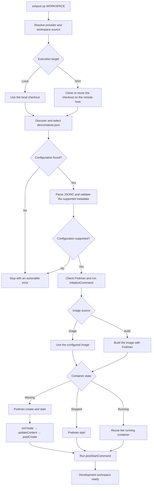

[](https://github.com/sshpod/sshpod/actions/workflows/test.yml)
[](https://codecov.io/github/sshpod/sshpod)

# sshpod

sshpod is an early-stage Dev Container orchestrator for Podman development
workspaces running locally or on an existing Linux machine over SSH. It discovers
and interprets `devcontainer.json`, then creates and manages the corresponding
Podman workspace. It is a small, focused alternative to DevPod for developers who
only need these two execution targets.

Version 0.1.x implements a deliberately limited vertical slice: discover a
`devcontainer.json`, create or start its container, report its status, and stop it.
It does not implement the full Dev Container specification.



sshpod owns the orchestration layer shown above; Podman remains the container
runtime. The primary compatibility target is the upstream
[Dev Container specification](https://containers.dev/implementors/spec/). sshpod
follows that specification where practical instead of defining an sshpod-specific
workspace format. The long-term goal is for existing DevPod/devcontainer projects
to migrate with little or no modification.

## Quick start

The project must contain a Dev Container configuration with either `image` or a
simple Dockerfile `build`. sshpod searches these specification-defined locations
in order:

1. `.devcontainer/devcontainer.json`
2. `.devcontainer.json`
3. `.devcontainer/<folder>/devcontainer.json`

If several nested configurations exist, an interactive terminal prompts for one.
Scripts and other non-interactive callers must select one explicitly:

```sh
sshpod up myproject --config .devcontainer/rust/devcontainer.json
```

The selection is saved for that workspace/provider target. If no configuration is
found, sshpod stops with an error listing the checked locations; it does not invent
a default environment or launch a container.

```sh
cargo install --path . --locked
sshpod provider add local --type local

cd /path/to/myproject
sshpod up myproject
sshpod
sshpod down myproject
```

The first `up` associates the logical workspace name with the current directory.
`sshpod` and `sshpod list` are equivalent. Containers are named deterministically
per workspace and provider and carry `sshpod.managed`, `sshpod.workspace`, and
`sshpod.provider` labels.

For a remote workspace, configure an OpenSSH host or alias:

```sh
sshpod provider add sandbox --type ssh --host sandbox

cd /path/to/a/git-checkout
sshpod up myproject --provider sandbox
sshpod down myproject --provider sandbox
```

sshpod asks the local Git checkout for its `remote.origin.url`, then runs `git
clone` on `sandbox` when the predictable remote workspace directory does not yet
exist. The remote checkout is reused on later starts. SSH options, identities,
proxy jumps, and hostnames remain in `~/.ssh/config`; sshpod invokes the system
`ssh` command and does not implement or duplicate SSH configuration.

A local directory cannot currently be synchronized to an SSH provider. A remote
Git URL is the supported automatic path. An existing absolute directory on the
remote host can be configured manually as described below.

## Providers and configuration

The command surface is intentionally small:

```text
sshpod [list]
sshpod up <workspace> [--provider <name>] [--config <path>]
sshpod down <workspace> [--provider <name>]
sshpod provider list
sshpod provider add <name> --type local [--podman <command>]
sshpod provider add <name> --type ssh --host <ssh-config-host> [--podman <command>] [--ssh-arg <arg>]...
sshpod provider delete <name>
sshpod doctor
```

Configuration is YAML at `$XDG_CONFIG_HOME/sshpod/config.yaml`. If
`XDG_CONFIG_HOME` is unset, empty, or relative, sshpod falls back to
`$HOME/.config/sshpod/config.yaml`. Reading configuration does not create either
the file or its directory; commands that write configuration create the directory
when needed.

```yaml
---
defaultProvider: local

providers:
  local:
    type: local

  sandbox:
    type: ssh
    host: sandbox

  infra-vm:
    type: ssh
    host: devops@infra.taildc7568.ts.net
    podman: podman
    sshArgs:
      - -A

workspaces:
  myproject:
    targets:
      local:
        source: /home/me/projects/myproject
      sandbox:
        source: git@github.com:example/myproject.git
        devcontainer: .devcontainer/rust/devcontainer.json
```

Only `local` and `ssh` provider types are supported. `podman` defaults to
`podman`, and `sshArgs` defaults to an empty list, so neither needs to be written
in a minimal provider. SSH `host` values are passed to the system OpenSSH client,
which means aliases from `~/.ssh/config` can be used directly.

The `defaultProvider`, custom `podman`, and `sshArgs` values are part of the
configuration API in this milestone, but do not yet alter workspace execution.
Existing runtime provider selection and command behavior remain unchanged.

The optional `devcontainer` value is managed when `--config` or the interactive
configuration selector is used. Paths are relative to the workspace source.

The target source for an SSH provider may instead be an existing absolute remote
path. A logical workspace can have several provider/source targets. With one
target, sshpod selects it automatically. With several targets, an interactive
terminal prompts for a provider; non-interactive use must pass `--provider` so
scripts remain deterministic. Deleting a provider also removes its workspace
targets and prunes workspaces that no longer have a target; it does not delete
containers or source directories.

The format intentionally carries none of DevPod's contexts, initialization
metadata, plugin options, credential-injection settings, agent paths, ports, or
inactivity state. sshpod stores only its own providers and optional workspace
state.

## Dev Container support

The current parser accepts JSON with C/C++-style comments and rejects unknown
properties rather than pretending to support them. It currently supports:

- specification-order discovery of `.devcontainer/devcontainer.json`,
  `.devcontainer.json`, and one-level nested configurations
- `name`, `image`, and simple `build.dockerfile` / `build.context`
- `workspaceFolder`, a bind-only `workspaceMount`, and string-form bind `mounts`
- `containerEnv`, `remoteEnv`, `containerUser`, and `remoteUser`
- string or argv-array forms of `initializeCommand`, `onCreateCommand`,
  `updateContentCommand`, `postCreateCommand`, and `postStartCommand`
- basic `${localWorkspaceFolder}`, workspace basename, container workspace folder,
  `${localEnv:NAME}`, and `${env:NAME}` substitution

`initializeCommand` runs on the selected host. The other lifecycle commands run
inside the container in their basic specification order. On SSH providers, host
and Podman commands execute through the configured OpenSSH host.

Not yet supported: lifecycle command objects, Dev Container Features,
`customizations`, Compose configurations, build arguments/options, non-bind mount
forms, ports/forwarding, `postAttachCommand`, full variable substitution, source
synchronization, container reconciliation after configuration changes, or the
remaining Dev Container specification.

## Direction and scope

Remote hosts must already exist, be reachable through OpenSSH, and have Podman and
Git installed as needed. sshpod manages workspace/container lifecycle; it does not
provision machines, implement SSH, replace Podman, manage IDEs, or orchestrate AI
agents. Kubernetes, Docker as a runtime, cloud providers, generic plugins, and the
broader DevPod provider ecosystem are deliberately outside its scope.

The long-term use case is persistent remote compute for humans and coding agents
such as Codex, Claude Code, and OpenCode, so the user's laptop need not remain
online. External tools such as Herdr, Moch, and tmux remain responsible for agent
and session management.

## Roadmap

Dev Container compatibility is the primary milestone. This checklist tracks
complete, compatibility-tested behavior. Prototype support described above does
not count as complete, so it remains unchecked until its semantics and real-world
compatibility have been validated.

### Core

- [x] Discover `.devcontainer/devcontainer.json`
- [x] Discover `.devcontainer.json`
- [x] Discover `.devcontainer/<folder>/devcontainer.json`
- [ ] Parse JSONC and validate the Dev Container configuration
- [ ] Environment-variable substitution
- [ ] Deterministic workspace/container naming

### Dev Container compatibility

- [ ] `image`
- [ ] `build`
- [ ] Dockerfile-based environments through Podman
- [ ] `containerEnv`
- [ ] `remoteEnv`
- [ ] `mounts`
- [ ] `workspaceMount`
- [ ] `workspaceFolder`
- [ ] `containerUser`
- [ ] `remoteUser`
- [ ] `forwardPorts`
- [ ] `portsAttributes`
- [ ] `features`
- [ ] `customizations`
- [ ] Full Dev Container variable substitution

### Lifecycle

- [ ] `initializeCommand`
- [ ] `onCreateCommand`
- [ ] `updateContentCommand`
- [ ] `postCreateCommand`
- [ ] `postStartCommand`
- [ ] `postAttachCommand`
- [ ] Lifecycle command execution and ordering
- [ ] Workspace start, stop, delete, and status
- [ ] Interactive exec/SSH into a workspace
- [ ] Persistent named volumes

### Local Podman

- [ ] Local Podman workspace creation

### SSH/Remote Podman

- [ ] Remote Podman workspace creation over system SSH
- [ ] Clone and reuse a remote Git workspace source
- [ ] Synchronize a local project directory to a remote host

### Compatibility and testing

- [ ] Unit coverage without requiring Podman or SSH
- [ ] Compatibility testing against real-world `.devcontainer` configurations

## Development

CLI definitions live in `src/cli/commands/`, dispatch in `src/cli/dispatch/`, and
presentation in `src/cli/actions/`. The named binary is in `src/bin/`, with the
library boundary in `src/lib.rs`. Provider execution, Dev Container parsing,
configuration, workspace orchestration, and Podman commands remain in small,
separate modules. There is no async runtime or generic provider/plugin layer.

Run `just test` for formatting, checking, tests, and strict Clippy. Ordinary tests
need neither Podman nor SSH. `just ci` additionally runs dependency policy checks.

```sh
cargo fmt --check
cargo check
cargo test
cargo clippy --all-targets --all-features -- -D warnings
```

`sshpod -V` prints the package version. `sshpod --version` also includes the source
Git commit when available; builds contain no timestamp.

This project uses the BSD-3-Clause license and adapts engineering conventions from
[cron-when](https://github.com/nbari/cron-when).
